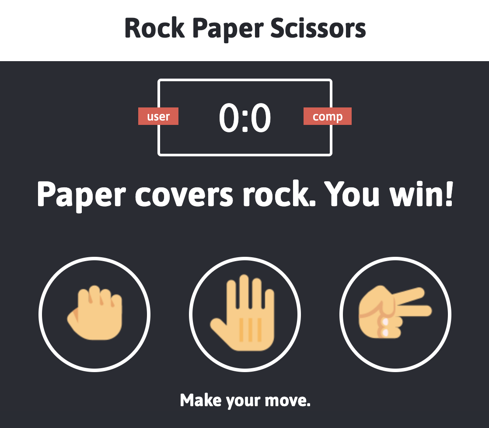

# Rock Paper Scissors Game

Fun rock paper scissors game!
[Deployment](https://anusontarangkul.github.io/rock-paper-scissors/)

## Description

This app is a fun game called rock paper scissors. The user selects either rock, paper, or scissors. At random, the computer will choose rock, paper, scissors.

Here are the possible outcomes:

- Rock beats scissors.
- Paper beats rock.
- Scissors beats paper.

Whoever wins the round, gets a point added. If the same objects are chosen, it is a draw.

## Installation

No installation is needed.

## Usage

Click the hand, paper, or scissors icon to start the game.

## Credits

|                           |                                                                                                                                                                                                       |
| ------------------------- | ----------------------------------------------------------------------------------------------------------------------------------------------------------------------------------------------------- |
| **David Anusontarangkul** | [ LinkedIn](https://www.linkedin.com/in/anusontarangkul/) [ GitHub](https://github.com/anusontarangkul) |

Tutorial followed
(freeCodeCamp)[https://www.youtube.com/watch?v=jaVNP3nIAv0]

## License

Copyright <2020> <David Anusontarangkul>

Permission is hereby granted, free of charge, to any person obtaining a copy of this software and associated documentation files (the "Software"), to deal in the Software without restriction, including without limitation the rights to use, copy, modify, merge, publish, distribute, sublicense, and/or sell copies of the Software, and to permit persons to whom the Software is furnished to do so, subject to the following conditions:

The above copyright notice and this permission notice shall be included in all copies or substantial portions of the Software.

THE SOFTWARE IS PROVIDED "AS IS", WITHOUT WARRANTY OF ANY KIND, EXPRESS OR IMPLIED, INCLUDING BUT NOT LIMITED TO THE WARRANTIES OF MERCHANTABILITY, FITNESS FOR A PARTICULAR PURPOSE AND NONINFRINGEMENT. IN NO EVENT SHALL THE AUTHORS OR COPYRIGHT HOLDERS BE LIABLE FOR ANY CLAIM, DAMAGES OR OTHER LIABILITY, WHETHER IN AN ACTION OF CONTRACT, TORT OR OTHERWISE, ARISING FROM, OUT OF OR IN CONNECTION WITH THE SOFTWARE OR THE USE OR OTHER DEALINGS IN THE SOFTWARE.

## Image Credit

(rock)[https://icons8.com/icons/set/hand-rock]
(hand)[https://icons8.com/icon/15434/hand-cursor]
(scissors)[https://icons8.com/icons/set/hand-scissors]
